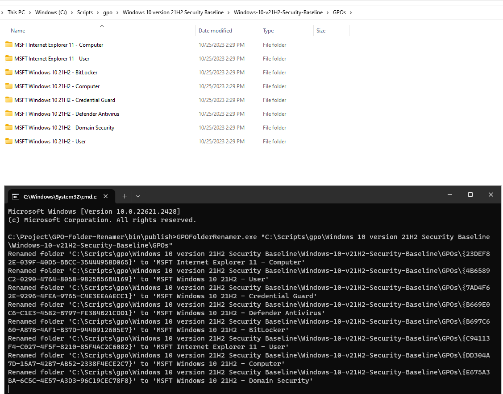

# GPO-Backup-Folder-Renamer

This tool recursively processes a folder structure, searching for "gpreport.xml" files within subfolders. When an "gpreport.xml" file is found, the application extracts a "Name" element from the XML and uses it to rename the containing folder. This renaming ensures that folder names are sanitized to conform to the file system's naming restrictions, replacing invalid characters with underscores. The primary goals are to automate the renaming process and maintain a clean and compliant folder structure.

Recently I had to download and match Local GPO backup with Microsoft Security Tool Kit baseline using Policy Analyzer tool, where I had to rename GUID folder name to human redable which was time consume process.

## Before

## After

## Usage

    GPOFolderRenamer.exe "<FolderPath>"

## Disclaimer

This tool has not been thoroughly tested and not responsible for any damage, if you find any bug, please log an issue.
